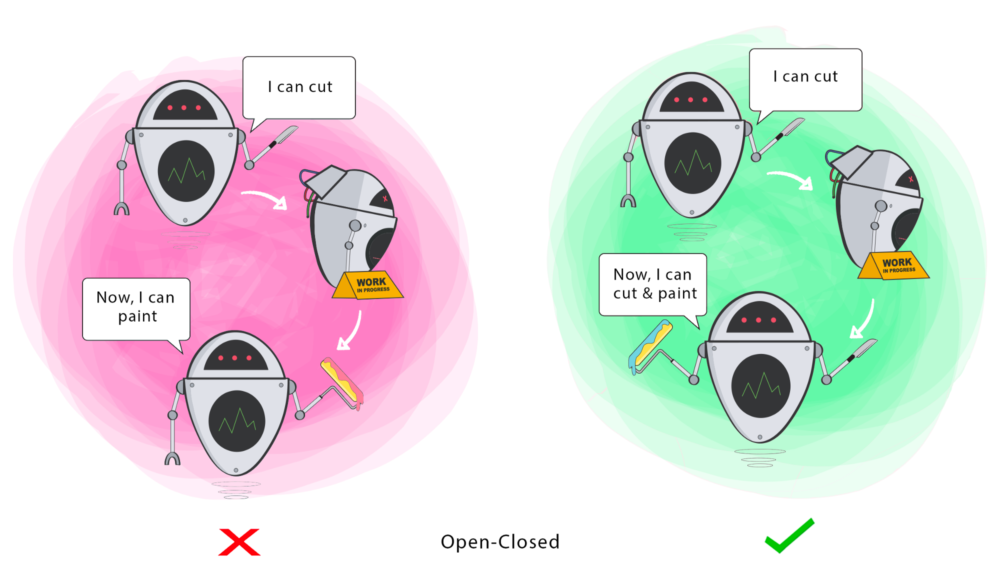

# Open Closed Principle

- Software entities should be **open for extension, but closed for modification**.
- Changing the current behaviour of a Class will affect all the systems using that Class.
- If you want the Class to perform more functions, the ideal approach is to **add to the functions** that already exist NOT change them.

## Goal

This principle aims to extend a Class’s behaviour without changing the existing behaviour of that Class. 
This is to avoid causing bugs wherever the Class is being used.

## Trick
Write code so that you will be able to **add new functionality without changing the existing code**.

* Open for Extension-
    * Add functionality to a class (more code).
    * Use inheritance to extend the functionality.
    * Use polymorphism.
    
* Closed for Modification-
    * Cannot change its source code.
    * Can only refactor or fix bugs but cannot add new functionality.
    
### Polymorphic OCP (New Definition)
* Our module depends on fixed abstractions that can be implemented by infinite number of implementations.
The interfaces are closed for modifications, but open for extension as we can always replace the current derivative with a new one.

* Depending on abstractions, not concrete implementations. So we can always change the implementation of the abstraction, but the class that depends on it will not break.
    
    
