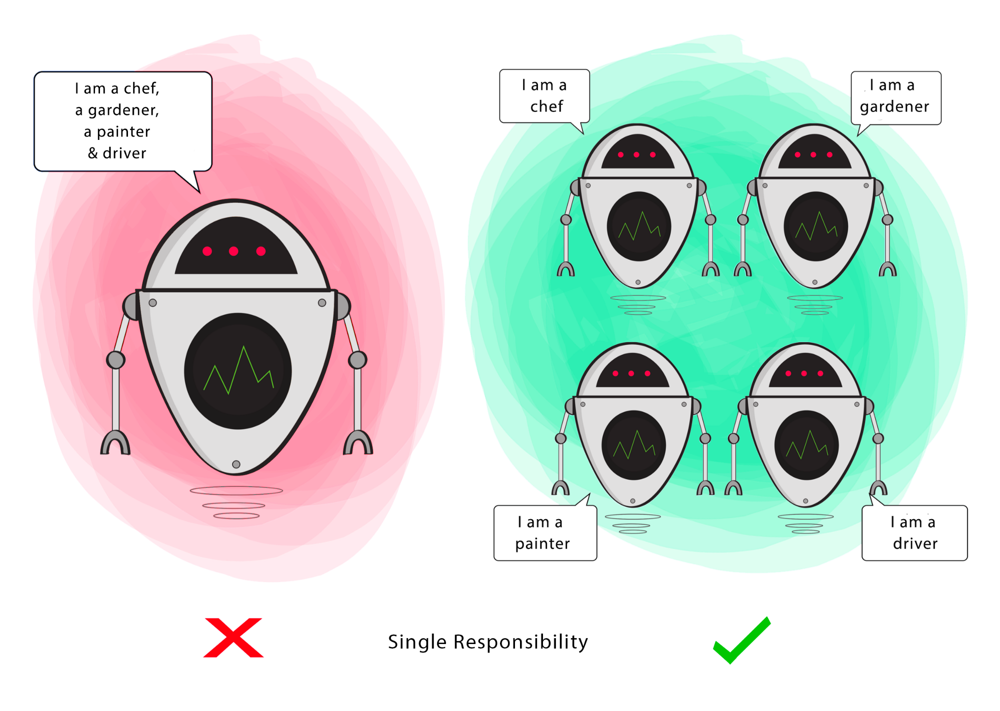

# Single Responsibility Principle

- A class should have only responsibility, **one single purpose**.
- If a class has many responsibilities, it increases the possibility of bugs because making changes to one of its
  responsibilities, could affect the other ones without you knowing.
- One Actor that is source of that change.

## Goal

This principle aims to separate behaviours so that if bugs arise as a result of your change, it won’t affect other
unrelated behaviours.

## Trick
* The trick of implementing SRP in our software is identifying the responsibility of each class.
* Decide the scope of the class.
* This ensures high cohesion, as well as robustness, which together reduce errors.
* Avoid overthinking as different operations may essentially serve one single purpose.